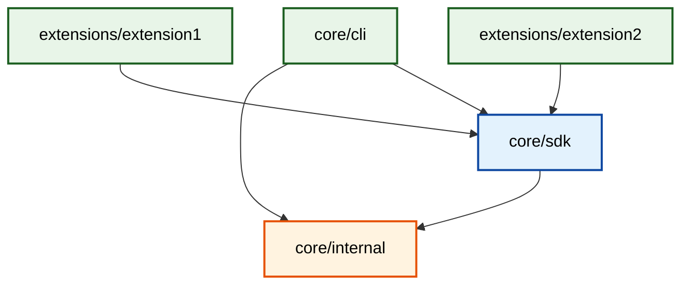

# Azure Dev Go Monorepo

This repository demonstrates a **multi-module Go monorepo design** that supports publishing multiple independent packages and CLI applications from a single repository. It implements Go's recommended workspace pattern for local development while maintaining clean module boundaries and independent versioning.

## 🎯 What This Repository Demonstrates

### **Multi-Module Architecture**

- **4 independent Go modules** with proper dependency relationships
- **3 CLI applications** built using the Cobra framework
- **Workspace-based development** with `go.work` for seamless local development
- **Independent versioning** using Git subdirectory tags

### **Module Publishing Strategy**

Each module can be independently:

- **Versioned** using semantic versioning
- **Published** to the Go module registry
- **Consumed** by external projects
- **Tagged** with subdirectory-prefixed Git tags

### **Real-World CLI Structure**

Demonstrates how to structure CLI applications that:

- Share common functionality through internal libraries
- Expose public APIs through SDK modules
- Maintain clean separation between internal and public packages
- Follow Go best practices for package organization

## 📁 Repository Structure

```text
azd-new/
├── go.work                        # Workspace configuration
│
├── core/                          # Core platform modules
│   ├── internal/                  # Shared utilities (private)
│   │   ├── go.mod                 # Module: github.com/wbreza/azd-new/core/internal
│   │   └── utils.go               # Logger, validation utilities
│   │
│   ├── sdk/                       # Public SDK (consumable by extensions)
│   │   ├── go.mod                 # Module: github.com/wbreza/azd-new/core/sdk
│   │   └── client.go              # SDK client for Azure operations
│   │
│   └── cli/                       # Main CLI application
│       ├── go.mod                 # Module: github.com/wbreza/azd-new/core/cli
│       ├── main.go                # CLI entry point
│       └── internal/cmd/          # Cobra commands
│           ├── root.go            # Root command
│           ├── deploy.go          # Deploy command
│           ├── init.go            # Init command
│           └── provision.go       # Provision command
│
└── extensions/                    # Extension CLI applications
    ├── extension1/                # Sample extension
    │   ├── go.mod                 # Module: github.com/wbreza/azd-new/extensions/extension1
    │   ├── main.go                # Extension entry point
    │   └── internal/cmd/          # Extension-specific commands
    │       ├── root.go            # Root command (azd-ext1)
    │       ├── custom.go          # Custom command
    │       └── integrate.go       # Integrate command
    │
    └── extension2/                # Monitoring extension
        ├── go.mod                 # Module: github.com/wbreza/azd-new/extensions/extension2
        ├── main.go                # Extension entry point
        └── internal/cmd/          # Monitoring commands
            ├── root.go            # Root command (azd-ext2)
            ├── monitor.go         # Monitor command
            └── analyze.go         # Analyze command
```

## 🔗 Module Dependencies & Visibility



### **Visibility Rules**

| Module | Can Import From | Description |
|--------|----------------|-------------|
| `core/internal` | Standard library only | Private utilities |
| `core/sdk` | `core/internal` | Public API for extensions |
| `core/cli` | `core/sdk`, `core/internal` | Main CLI application |
| `extensions/*` | `core/sdk` only | Extension CLIs (no access to internals) |

## 🏷️ Tagging & Versioning Strategy

Each module is independently versioned using **subdirectory-prefixed Git tags**:

### **Tag Format**

```text
{module-path}/v{version}
```

### **Example Tags**

```bash
core/internal/v1.0.0          # Internal utilities v1.0.0
core/sdk/v1.2.0               # SDK v1.2.0  
core/cli/v2.1.0               # CLI v2.1.0
extensions/extension1/v0.5.0  # Extension1 v0.5.0
extensions/extension2/v0.3.0  # Extension2 v0.3.0
```

### **Release Workflow**

Tags must be created in dependency order (upstream → downstream):

```bash
# 1. Tag internal module first
git tag core/internal/v1.1.0
git push origin core/internal/v1.1.0

# 2. Update SDK to use new internal version, then tag
# Edit core/sdk/go.mod: require github.com/wbreza/azd-new/core/internal v1.1.0
git tag core/sdk/v1.3.0
git push origin core/sdk/v1.3.0

# 3. Update CLI to use new SDK version, then tag
# Edit core/cli/go.mod: require github.com/wbreza/azd-new/core/sdk v1.3.0
git tag core/cli/v2.2.0
git push origin core/cli/v2.2.0

# 4. Extensions can be tagged independently
git tag extensions/extension1/v0.6.0
git push origin extensions/extension1/v0.6.0
```

## 🚀 Getting Started

### **Prerequisites**

- Go 1.25 or later
- Git

### **Clone and Build**

```bash
git clone https://github.com/wbreza/azd-new.git
cd azd-new

# Build all CLI applications
go build -o azd.exe ./core/cli
go build -o azd-ext1.exe ./extensions/extension1
go build -o azd-ext2.exe ./extensions/extension2
```

### **Try the CLIs**

```bash
# Main Azure Dev CLI
./azd.exe deploy myapp
./azd.exe init web-template
./azd.exe provision

# Extension 1 - Custom operations
./azd-ext1.exe custom myresource
./azd-ext1.exe integrate github

# Extension 2 - Monitoring
./azd-ext2.exe monitor myapp
./azd-ext2.exe analyze compute
```

## 🛠️ Development

### **Workspace Mode (Local Development)**

The `go.work` file enables seamless local development:

```bash
# Run without building
go run ./core/cli deploy myapp
go run ./extensions/extension1 custom myresource

# Test all modules
go test ./...

# Sync workspace dependencies
go work sync
```

## 🎛️ Release Modes

### **Development Mode (Workspace)**

- Uses local module versions
- Enables rapid iteration
- Supports go run commands

### **Production Mode (Pinned Versions)**

```bash
# Build with specific versions (disable workspace)
GOWORK=off go build -mod=readonly ./core/cli

# Test against pinned versions
cd core/sdk && GOWORK=off go test -mod=readonly ./...
```
